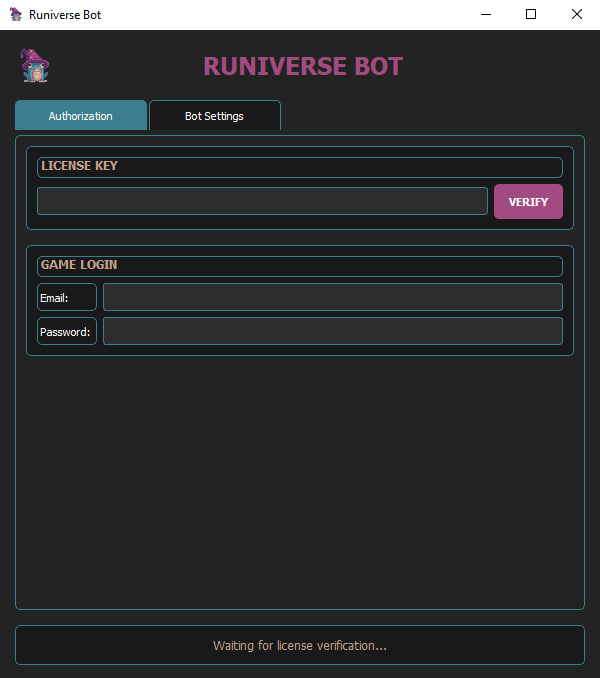

  
  <h1>Runiverse Auto-Combat Bot</h1>
  
Automates routine battles in Forgotten Runiverse, saving 50+ hours of grinding

  
  

## 🔥 Features
- Auto-skill usage in an optimal sequence
- Works 24/7 with battle restart
- Secure connection via ChromeDriver

## ⚙️ Installation
1. Download the latest version from [Releases](https://github.com/Roblodevv/Forgotten_Runiverse_Bot)
2. Download the latest version from [Chromedriver](https://googlechromelabs.github.io/chrome-for-testing/)
3. Run `RuniverseBot.exe`
4. Enter your license key

## 💰 Subscription
Available plans:
- 24 hours - $8
- 3 days - $16
- 1 week - $25

**Purchase:** [Telegram @roblodev](https://t.me/roblodev) | [Discord](https://discord.gg/Tj6fvJTm)

## ⚠️ Important
- The bot does not modify the game client
- Works only on Windows 10/11
- License is hardware-bound

## 📬 Support
- Technical questions: [Discord](https://discord.gg/Tj6fvJTm)
- Urgent help: [@roblodev в Telegram](https://t.me/roblodev)

